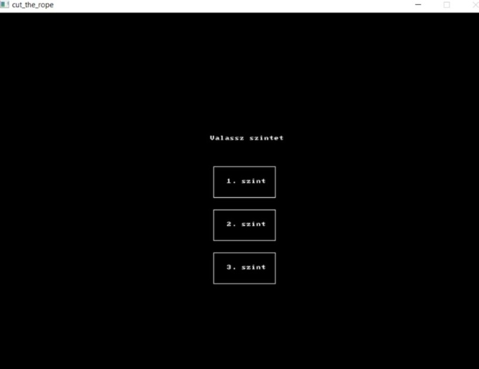
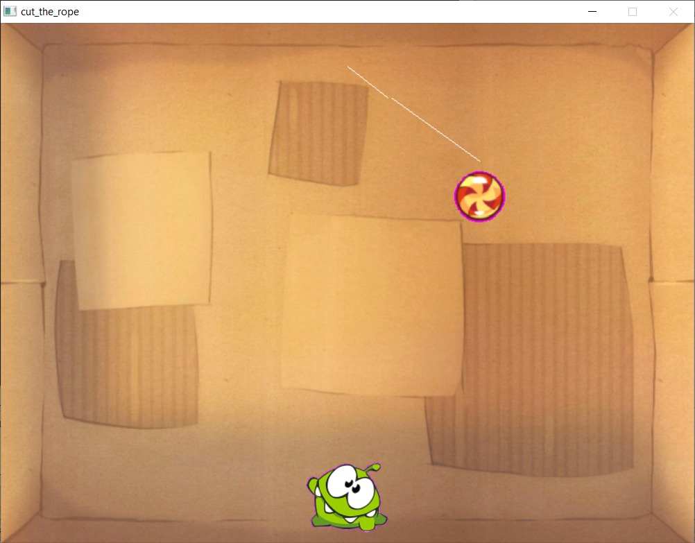

# Cut the Rope - Allegro Recreation 🐸🍬

This is a recreation of the *Cut the Rope* mechanics, built entirely in my **free time** as a deep dive into game physics and retro graphics programming.

## 🛠 The Challenge: "Vintage" Development
This project was written using **Allegro 4.0**. 

Allegro is one of the oldest and most "ancient" game programming libraries (originally released in the early 90s). Choosing to use Allegro 4 meant:
* **No modern engines:** No Unity, no Unreal, no built-in physics. 
* **Manual Math:** I had to manually implement the rope's pendulum physics using trigonometry (`sin` and `cos`) and gravity acceleration.
* **Low-level Rendering:** Handling bitmapped buffers and manual sprite blitting—the way games were made decades ago.

## 📸 Previews

### Start Menu
The level selector where players can choose between three different difficulty setups.

  

### Gameplay Action
Visualizing the rope physics and the "Om Nom" (Béka) character waiting for the candy.

  

## 🚀 Features
* **Custom Physics Engine:** Realistic pendulum swing logic and projectile motion once the rope is cut.
* **Three Challenging Levels:** Different anchor points to test timing and aim.
* **Classic Graphics:** Uses legacy `.bmp` assets for that authentic retro feel.
* **Win/Loss Logic:** Detects collision with the character's mouth or if the candy falls out of bounds.

## 🕹️ Controls
* **Mouse:** Click and drag across the rope to "cut" it.
* **Esc:** Exit the game.

## ❗ Important
* This is a geometry and mathematics based project. It's purpose was to enhance my programming and mathematical skills.
---
*Created with ❤️ in my spare time to keep the spirit of old-school game dev alive.*
